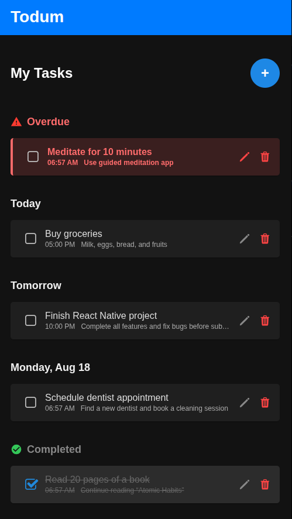
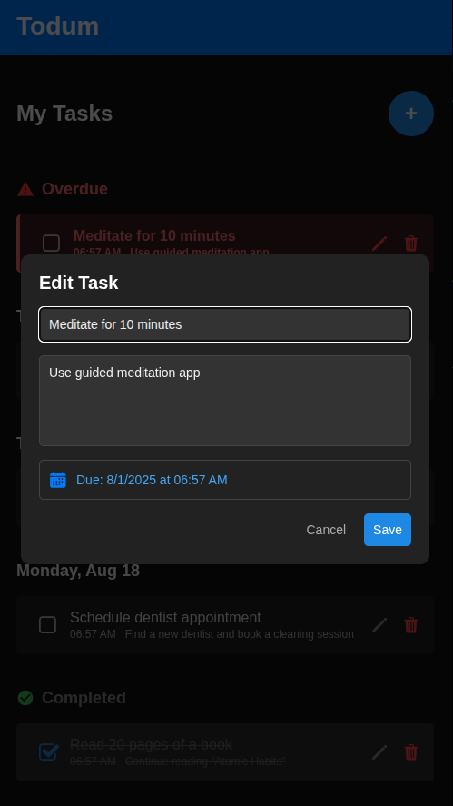
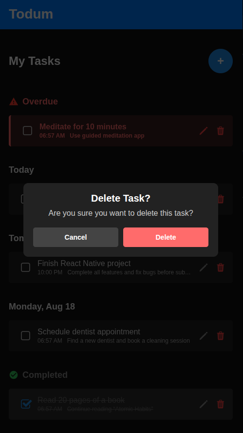
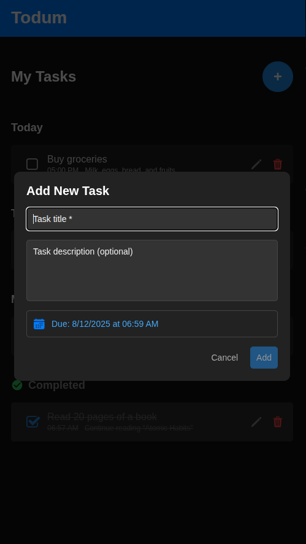

# Todum - Simple Task Manager App

## Overview

This is a React Native Task Manager app built with **Expo**.  
It allows users to:

- Add new tasks (with optional description and due date)
- Mark tasks as complete
- Delete tasks
- View tasks grouped by **Overdue**, **Today**, **Tomorrow**, future dates, and **Completed**

> The app also includes **task persistence** using AsyncStorage so tasks remain after closing the app.

---

## Gallery

<table>
  <tr>
    <td></td>
    <td></td>
  </tr>
  <tr>
    <td></td>
    <td></td>
  </tr>
</table>

---

## Features

- **Add Task** — Enter a title (required), description (optional), and select a due date/time.
- **Mark Complete** — Check off tasks, visually striking them through.
- **Delete Task** — Remove tasks with a confirmation prompt.
- **Task List** — See all tasks grouped by due date and status.
- **Overdue Alerts** — The app alerts you if tasks are overdue (with a 5-minute grace period).
- **Task Details View** — View full description and metadata in a modal.
- **Persistent Storage** — Tasks are saved locally via AsyncStorage.

---

## Project Structure

```
todum/
├── app/
│   └── index.tsx                     # Main application logic and state management
│
├── components/
│   ├── TaskList.tsx                  # Displays grouped task sections
│   ├── TaskItem.tsx                  # Renders individual task items
│   ├── AddTaskModal.tsx              # Task creation form
│   ├── EditTaskModal.tsx             # Task editing interface
│   ├── TaskDetailsModal.tsx          # Detailed task view
│   └── DeleteConfirmationModal.tsx   # Delete task confirmation
│
├── services/
│   └── storage.ts                    # Handles AsyncStorage operations
│
├── utils/
│   ├── date.ts                       # Date formatting helpers
│   └── taskGrouping.ts               # Task categorization logic
│
├── types/
│   └── task.ts                       # TypeScript type definitions
│d
├── styles/
│   └── index.ts                      # Shared styling constants
│
├── assets/                           # Static assets
│   ├── images/                       # App images and icons
│   └── fonts/                        # Custom font files
```

---

## Installation & Setup

### 1. Clone the Repository

```bash
git clone https://github.com/adelsrour/todum.git
cd todum
```

### 2. Install Dependencies

```bash
npm install
```

### 3. Install Expo CLI (if not already installed)

```bash
npm install -g expo-cli
```

### 4. Run the App

```bash
npx expo start
```

- Press `i` to run on iOS Simulator (Mac only)
- Press `a` to run on Android Emulator
- Or scan the QR code with the Expo Go app on your device

---

## Third-Party Libraries Used

- **[@expo/vector-icons](https://docs.expo.dev/guides/icons/)** — Icons for UI elements.
- **[@react-native-async-storage/async-storage](https://github.com/react-native-async-storage/async-storage)** — Local storage for persisting tasks.
- **[@react-native-community/datetimepicker](https://github.com/react-native-datetimepicker/datetimepicker)** — Native date & time picker.
- **[react-native-elements](https://reactnativeelements.com/)** — UI components (checkbox).

---

## How It Works

- Tasks are stored in local component state (`useState` in `app/index.tsx`).
- State updates trigger AsyncStorage saves.
- Components receive data and event handlers via props.
- UI updates instantly in response to user actions.

---

## Notes

- **Persistence:** Tasks are saved locally using AsyncStorage to ensure they remain after closing the app.
- **Grouping Logic:** Tasks are grouped into sections for better readability.
- **Overdue Handling:** Overdue tasks are visually distinct and alerted at load.

---

## License

MIT
